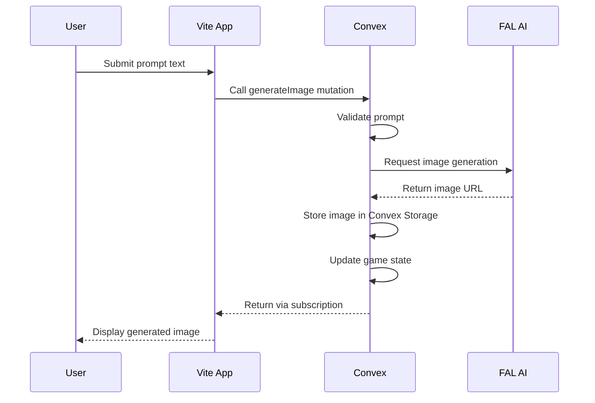
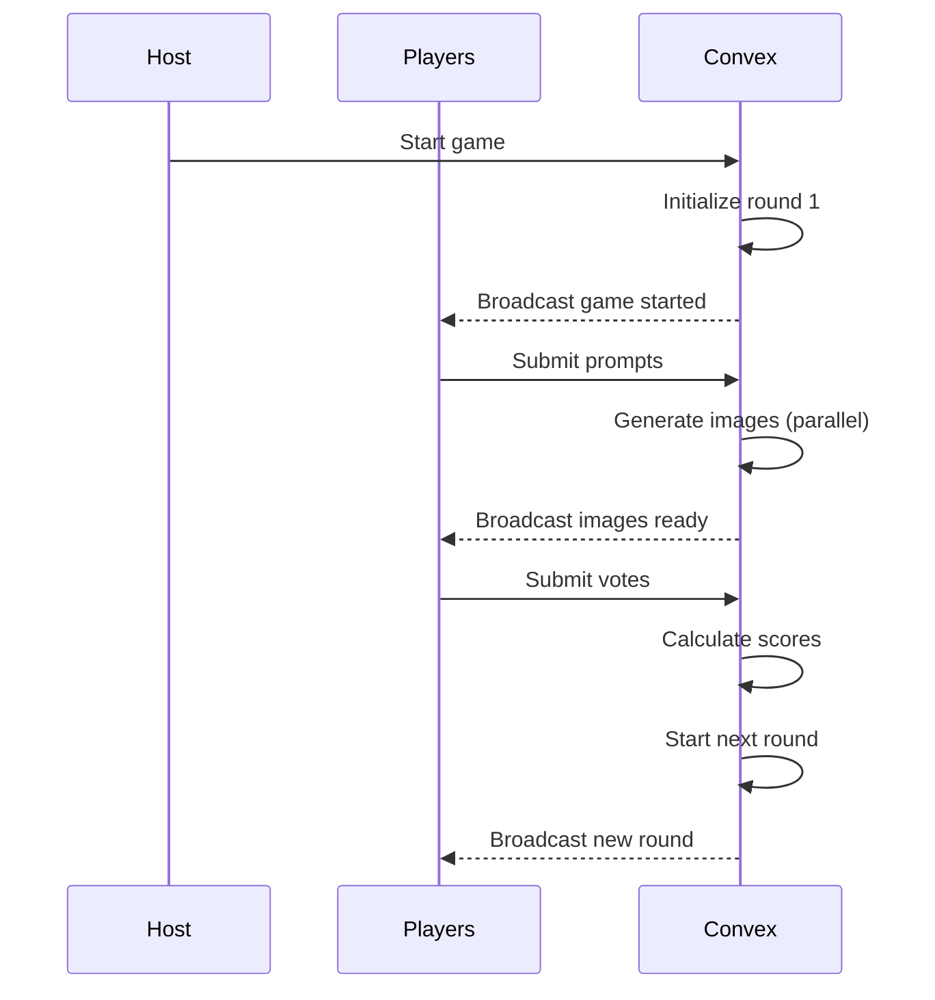

# Product Requirements Document: AI Image Party Game with Vite & Convex

## 1. Executive Summary

### 1.1 Product Overview

An online multiplayer party game where players compete by generating AI images in response to creative prompts. Players submit text prompts to FAL AI's Flux model to generate images that best match the round's question card. A rotating "Card Czar" judges the submissions, awarding points for the most entertaining, creative, or fitting images. The game features a complete web application with marketing pages, authentication flows, user dashboards, and real-time gameplay powered by Convex's reactive backend.

### 1.2 Key Technologies

- **Frontend Framework**: Vite + React 18
- **UI Components**: shadcn/ui + Tailwind CSS
- **Backend**: Convex (reactive database, functions, file storage)
- **Authentication**: Convex Auth (built-in OAuth & email/password)
- **AI Generation**: FAL AI (Flux Model)
- **Deployment**: Vercel (Static) + Convex Cloud (backend)
- **Real-time**: Convex reactive subscriptions
- **Analytics**: Vercel Analytics + PostHog
- **Routing**: React Router v6

### 1.3 Target Audience

- **Primary**: Adults aged 18-35 who enjoy creative party games and AI art
- **Secondary**: Friend groups looking for online entertainment
- **Tertiary**: Remote teams seeking creative ice-breaker activities

## 2. Product Goals & Objectives

### 2.1 Primary Goals

- Create a complete web application with landing page, auth, and game
- Enable viral growth through shareable room links with custom OG images
- Support 3-10 concurrent players per game room
- Generate high-quality AI images with optimized performance
- Achieve <10 second total image generation time for all players
- Leverage Vite for fast development and Convex for real-time features

### 2.2 Success Metrics

- 10,000+ monthly active users within 6 months
- 40% week-over-week retention rate
- Average session duration of 30+ minutes
- 4.5+ star rating on review platforms
- <10 second average image generation time
- 99.9% uptime
- <$0.50 average cost per game session
- 25% conversion rate from landing page to sign-up

## 3. Application Architecture

### 3.1 Vite React Application Structure

```
┌──────────────────────────────────────┐
│         Vite React Application       │
├──────────────────────────────────────┤
│                                      │
│  ┌────────────────────────────────┐ │
│  │   Static Marketing Pages       │ │
│  │  • Landing Page                │ │
│  │  • Features                    │ │
│  │  • Pricing                     │ │
│  │  • How to Play                 │ │
│  └────────────────────────────────┘ │
│                                      │
│  ┌────────────────────────────────┐ │
│  │   Auth Components (Convex)     │ │
│  │  • Sign In/Up                  │ │
│  │  • OAuth Providers             │ │
│  │  • Protected Routes            │ │
│  └────────────────────────────────┘ │
│                                      │
│  ┌────────────────────────────────┐ │
│  │    App Pages (Protected)       │ │
│  │  • Dashboard                   │ │
│  │  • Profile                     │ │
│  │  • Room Lobby                  │ │
│  └────────────────────────────────┘ │
│                                      │
│  ┌────────────────────────────────┐ │
│  │    Game Client (Real-time)     │ │
│  │  • Real-time Game Play         │ │
│  │  • Convex Subscriptions        │ │
│  └────────────────────────────────┘ │
│                                      │
└──────────────────────────────────────┘
                    ↓
         Convex Backend Platform
         ├── Reactive Database
         ├── Scheduled Functions
         ├── File Storage
         └── Real-time Subscriptions
                    ↓
         External Services
         ├── FAL AI (Flux Model)
         └── OAuth Providers (Google, GitHub, etc.)
```

### 3.2 File Structure

```
ai-image-party-game/
├── src/
│   ├── components/
│   │   ├── marketing/
│   │   │   ├── Hero.tsx
│   │   │   ├── FeaturesGrid.tsx
│   │   │   ├── Testimonials.tsx
│   │   │   ├── CTASection.tsx
│   │   │   └── PricingCards.tsx
│   │   ├── game/
│   │   │   ├── GameRoom.tsx
│   │   │   ├── PromptInput.tsx
│   │   │   ├── ImageGallery.tsx
│   │   │   ├── VotingPhase.tsx
│   │   │   ├── PlayerPresence.tsx
│   │   │   └── RoundTimer.tsx
│   │   ├── dashboard/
│   │   │   ├── StatsCards.tsx
│   │   │   ├── RecentGames.tsx
│   │   │   └── QuickActions.tsx
│   │   ├── ui/                         # shadcn/ui components
│   │   │   ├── button.tsx
│   │   │   ├── card.tsx
│   │   │   └── ...
│   │   ├── layout/
│   │   │   ├── AppLayout.tsx
│   │   │   ├── MarketingLayout.tsx
│   │   │   └── GameLayout.tsx
│   │   └── auth/
│   │       ├── SignIn.tsx
│   │       ├── SignUp.tsx
│   │       └── ProtectedRoute.tsx
│   ├── pages/
│   │   ├── LandingPage.tsx
│   │   ├── FeaturesPage.tsx
│   │   ├── HowToPlayPage.tsx
│   │   ├── PricingPage.tsx
│   │   ├── Dashboard.tsx
│   │   ├── Profile.tsx
│   │   ├── RoomLobby.tsx
│   │   └── GameClient.tsx
│   ├── lib/
│   │   ├── utils.ts
│   │   ├── constants.ts
│   │   └── router.tsx                  # React Router setup
│   ├── hooks/
│   │   ├── useAuth.ts
│   │   ├── useRoom.ts
│   │   └── useGame.ts
│   ├── App.tsx
│   ├── main.tsx
│   └── index.css
├── convex/
│   ├── schema.ts
│   ├── auth.ts                         # Convex Auth configuration
│   ├── rooms.ts
│   ├── game.ts
│   ├── images.ts
│   └── ...
├── public/
│   ├── images/
│   ├── fonts/
│   └── favicon.ico
├── index.html
├── vite.config.ts
├── tailwind.config.ts
└── package.json
```

## 4. State Management Patterns

### Client State (React)

- UI state (modals, dropdowns): useState
- Form state: react-hook-form or useState
- Navigation state: React Router
- Global UI state: Context API (for themes, etc.)

### Server State (Convex)

- All game state: Convex database
- Real-time updates: Convex subscriptions
- No client-side game state duplication

### State Update Flow

1. User action triggers Convex mutation
2. Mutation updates database
3. Subscriptions push updates to all clients
4. React components re-render with new data

⚠️ **IMPORTANT**: Never store game state in React state. All game state must live in Convex and be accessed via subscriptions.

## 5. Data Flow Diagrams

### 5.1 Image Generation Flow



### 5.2 Game State Flow



## 6. Feature Implementation Roadmap (Vertical Slices)

### Feature 0: Foundation & Authentication (Prerequisites)

**Definition of Done**: User can sign up, sign in, and see a basic dashboard

**Implementation**:

- Vite React project setup with TypeScript and Tailwind
- React Router v6 configuration
- Convex backend initialization and connection
- Convex Auth setup with OAuth providers
- Protected routes with React Router
- Basic dashboard page (even if empty)
- Database schema for users table only
- Deploy to Vercel + Convex (establish CI/CD early)

**Acceptance Criteria**:

- ✅ New user can sign up with email or OAuth
- ✅ User lands on dashboard after authentication
- ✅ Protected routes redirect to sign-in
- ✅ User data stored in Convex database
- ✅ React Router navigation works correctly

**Test Cases**:

````typescript
describe('Authentication', () => {
  test('redirects unauthenticated users to sign-in', async () => {
    // Navigate to protected route
    // Verify redirect to /sign-in
  ### 15.5 User Profile Component

```typescript
// src/components/auth/UserProfile.tsx
import { useAuthActions } from '@convex-dev/auth/react';
import { useConvexAuth, useQuery } from 'convex/react';
import { api } from '../../convex/_generated/api';
import { Button } from '@/components/ui/button';
import { Card, CardContent, CardHeader, CardTitle } from '@/components/ui/card';
import { Avatar, AvatarFallback, AvatarImage } from '@/components/ui/avatar';
import { LogOut, Settings } from 'lucide-react';

export function UserProfile() {
  const { signOut } = useAuthActions();
  const { isAuthenticated } = useConvexAuth();
  const user = useQuery(api.users.getCurrentUser);

  if (!isAuthenticated || !user) {
    return null;
  }

  const handleSignOut = async () => {
    await signOut();
  };

  return (
    <Card className="w-full max-w-md">
      <CardHeader>
        <CardTitle className="flex items-center gap-3">
          <Avatar>
            <AvatarImage src={user.imageUrl} />
            <AvatarFallback>
              {user.name?.charAt(0)?.toUpperCase() || user.email?.charAt(0)?.toUpperCase()}
            </AvatarFallback>
          </Avatar>
          <div>
            <div className="font-semibold">{user.name || 'Anonymous User'}</div>
            <div className="text-sm text-muted-foreground">{user.email}</div>
          </div>
        </CardTitle>
      </CardHeader>
      <CardContent className="space-y-4">
        <div className="grid grid-cols-3 gap-4 text-center">
          <div>
            <div className="font-bold text-lg">{user.gamesPlayed}</div>
            <div className="text-sm text-muted-foreground">Games</div>
          </div>
          <div>
            <div className="font-bold text-lg">{user.gamesWon}</div>
            <div className="text-sm text-muted-foreground">Wins</div>
          </div>
          <div>
            <div className="font-bold text-lg">{user.totalScore}</div>
            <div className="text-sm text-muted-foreground">Score</div>
          </div>
        </div>
        
        <div className="flex gap-2">
          <Button variant="outline" className="flex-1">
            <Settings className="mr-2 h-4 w-4" />
            Settings
          </Button>
          <Button variant="outline" onClick={handleSignOut}>
            <LogOut className="mr-2 h-4 w-4" />
            Sign Out
          </Button>
        </div>
      </CardContent>
    </Card>
  );
}
```);
  
  test('syncs user data to Convex on first sign-in', async () => {
    // Sign up new user
    // Verify user record created in Convex
  });
  
  test('allows authenticated access to dashboard', async () => {
    // Sign in
    // Navigate to dashboard
    // Verify dashboard loads
  });
});
````

### Feature 1: Room Management System

**Definition of Done**: Users can create, join, and share rooms

**Implementation**:

- Room creation with unique 6-character codes
- Room joining via code
- Room lobby page showing connected players
- Shareable room links with social meta tags
- Real-time player presence in lobby
- Database: rooms, players, presence tables
- Fixed room settings (8 players, 30s timer, 10 rounds)
- React Router dynamic routes for rooms

**Acceptance Criteria**:

- ✅ User can create room with unique code
- ✅ User can join room with valid code
- ✅ Invalid codes show error message
- ✅ Lobby shows all connected players in real-time
- ✅ Room link generates custom meta tags
- ✅ Two users can see each other in same room

**Test Cases**:

```typescript
describe('Room Management', () => {
  test('creates room with unique 6-char code', async () => {
    // Call createRoom mutation
    // Verify code is 6 uppercase letters
  });
  
  test('prevents duplicate room codes', async () => {
    // Create room with specific code
    // Try to create another with same code
    // Verify different code generated
  });
  
  test('allows joining with valid code', async () => {
    // Create room
    // Join with code
    // Verify player added to room
  });
  
  test('shows error for invalid code', async () => {
    // Try to join with non-existent code
    // Verify error message displayed
  });
  
  test('updates player count in real-time', async () => {
    // User A creates room
    // User B joins room
    // Verify User A sees User B immediately
  });
});
```

### Feature 2: Game Flow Without AI

**Definition of Done**: Complete game loop works with placeholder images

**Implementation**:

- Start game from lobby (host only)
- Round progression state machine
- Card Czar rotation system
- Timer system for each phase
- Prompt submission interface
- Placeholder colored boxes instead of images
- Voting mechanism
- Score tracking and round winners
- Game over screen with final scores
- Database: rounds, prompts, questionCards tables (seed with 50 cards)

**Acceptance Criteria**:

- ✅ Host can start game with 3+ players
- ✅ Each round has prompting → viewing → voting phases
- ✅ Card Czar rotates each round
- ✅ Timer enforces phase transitions
- ✅ Players can submit prompts
- ✅ Colored placeholders appear for each prompt
- ✅ Card Czar can vote for winner
- ✅ Scores update after each round
- ✅ Game ends after set rounds with winner display

**Test Cases**:

```typescript
describe('Game Flow', () => {
  test('only host can start game', async () => {
    // Non-host tries to start
    // Verify error
    // Host starts game
    // Verify success
  });
  
  test('rotates card czar each round', async () => {
    // Start game with 3 players
    // Check czar for round 1
    // Complete round
    // Verify different czar for round 2
  });
  
  test('enforces timer for prompt phase', async () => {
    // Start round
    // Wait for timer expiry
    // Verify automatic transition to next phase
  });
  
  test('calculates scores correctly', async () => {
    // Player A wins round 1 (gets 1 point)
    // Player B wins round 2 (gets 1 point)
    // Verify scores: A=1, B=1, others=0
  });
  
  test('completes full game flow', async () => {
    // Play through all rounds
    // Verify game over screen
    // Verify final scores displayed
  });
});
```

### Feature 3: AI Image Generation

**Definition of Done**: Real AI images replace placeholders

**Implementation**:

- FAL AI integration in Convex
- Parallel image generation from prompts
- Image storage in Convex
- Error handling with fallback to placeholder
- Loading states during generation
- Database: generatedImages table
- Simple retry logic (1 retry on failure)

**Acceptance Criteria**:

- ✅ Prompts generate real AI images
- ✅ All images generate in parallel
- ✅ Images stored in Convex storage
- ✅ Failed generations show error placeholder
- ✅ Loading spinner during generation
- ✅ Images display in voting phase

**Test Cases**:

```typescript
describe('AI Image Generation', () => {
  test('generates image from prompt', async () => {
    // Submit prompt "a cat in space"
    // Wait for generation
    // Verify image URL returned and displayed
  });
  
  test('handles generation errors gracefully', async () => {
    // Submit prompt that triggers error
    // Verify fallback placeholder shown
    // Verify game continues
  });
  
  test('generates all images in parallel', async () => {
    // 4 players submit prompts
    // Measure time for all images
    // Verify < 15 seconds total
  });
  
  test('stores images in Convex storage', async () => {
    // Generate image
    // Verify storage ID in database
    // Verify image accessible via URL
  });
});
```

### Feature 4: Landing Page & Marketing

**Definition of Done**: Complete marketing site drives conversions

**Implementation**:

- Hero section with Create/Join CTAs
- Features grid section
- How to play section with visuals
- Live stats integration (games played, images created)
- Testimonials section (can use mock data initially)
- Final CTA section
- SEO meta tags and social sharing tags
- Analytics integration (page views, conversions)
- React Router integration for marketing pages

**Acceptance Criteria**:

- ✅ Landing page loads in <3 seconds
- ✅ Create Room CTA leads to sign-up/dashboard
- ✅ Join Room input accepts 6-char codes
- ✅ Stats update from real database
- ✅ All sections responsive on mobile
- ✅ Analytics tracks conversions

**Test Cases**:

```typescript
describe('Landing Page', () => {
  test('loads with all sections', async () => {
    // Load landing page
    // Verify hero, features, how-to, testimonials, CTA sections present
  });
  
  test('create room flow for new users', async () => {
    // Click Create Room as logged-out user
    // Verify redirect to sign-up
    // Complete sign-up
    // Verify redirect to dashboard with create action
  });
  
  test('join room with code', async () => {
    // Enter valid room code
    // Click Join
    // Verify navigation to /room/[code]
  });
  
  test('displays live stats', async () => {
    // Load page
    // Verify stats match database values
  });
});
```

### Feature 5: User Dashboard & Stats

**Definition of Done**: Users have personalized dashboard experience

**Implementation**:

- Personal statistics cards (games played/won, images created)
- Recent games history list
- Quick action buttons (Create/Join/Browse)
- Public rooms browser
- Basic profile management
- Database: userStats, gameStats tables

**Acceptance Criteria**:

- ✅ Dashboard shows user's lifetime stats
- ✅ Recent games list with dates and scores
- ✅ Quick actions work correctly
- ✅ Can browse and join public rooms
- ✅ Can update username and avatar

**Test Cases**:

```typescript
describe('User Dashboard', () => {
  test('displays correct user statistics', async () => {
    // User with 5 games, 2 wins
    // Load dashboard
    // Verify stats show 5 played, 2 won
  });
  
  test('shows recent games in order', async () => {
    // User with multiple games
    // Verify games sorted by date descending
  });
  
  test('quick create room action', async () => {
    // Click Create Room
    // Verify room created and redirected
  });
  
  test('browse public rooms', async () => {
    // Navigate to browse
    // Verify list of public rooms
    // Join a room
    // Verify successful join
  });
});
```

### Feature 6: Polish & Advanced Features

**Definition of Done**: Production-ready with delightful UX

**Implementation**:

- Smooth animations and transitions (Framer Motion)
- Sound effects for key actions (optional)
- Custom room settings UI
- Public/private room toggle
- Image regeneration feature (up to 3 times)
- Thumbnail generation for images
- Spectator mode for late joiners
- Better error handling with toast notifications
- Loading skeletons for all async content

**Acceptance Criteria**:

- ✅ All interactions have smooth animations
- ✅ Room settings customizable by host
- ✅ Players can regenerate images
- ✅ Spectators can watch without playing
- ✅ All errors show user-friendly messages
- ✅ No layout shift during loading

## 7. Feature Verification Checkpoints

### After Each Feature Implementation:

1. [ ] All acceptance criteria met
2. [ ] Unit tests passing (>80% coverage)
3. [ ] E2E test for feature passing
4. [ ] No TypeScript errors
5. [ ] No console errors/warnings
6. [ ] Deployed to staging
7. [ ] Manual QA completed
8. [ ] Documentation updated

⚠️ **Do not proceed to next feature until all checkpoints pass**

## 8. Error Handling Requirements

### Image Generation Errors

- Retry once with exponential backoff
- Fall back to colored placeholder after failures
- Log errors to monitoring service
- Show user-friendly error message: "Image generation failed. Using placeholder."

### Network Errors

- Implement optimistic updates where safe
- Show connection status indicator
- Auto-retry with backoff
- Display toast: "Connection lost. Retrying..."

### Game State Errors

- Implement state recovery mechanism
- Allow host to reset stuck games
- Auto-cleanup abandoned games after 1 hour
- Show "Game state error. Please refresh." with refresh button

### User Input Errors

- Validate room codes (6 uppercase letters)
- Validate prompts (max 200 characters)
- Show inline validation errors
- Prevent submission of invalid data

## 9. Convex Database Schema

```typescript
// convex/schema.ts
import { defineSchema, defineTable } from "convex/server";
import { v } from "convex/values";

export default defineSchema({
  // Users table (managed by Convex Auth)
  users: defineTable({
    name: v.optional(v.string()),
    email: v.optional(v.string()),
    emailVerificationTime: v.optional(v.number()),
    phone: v.optional(v.string()),
    phoneVerificationTime: v.optional(v.number()),
    isAnonymous: v.optional(v.boolean()),
    username: v.optional(v.string()),
    imageUrl: v.optional(v.string()),
    gamesPlayed: v.number(),
    gamesWon: v.number(),
    totalScore: v.number(),
    createdAt: v.number(),
    lastSeenAt: v.number(),
  }).index("email", ["email"])
    .index("username", ["username"]),

  // Auth accounts table (managed by Convex Auth)
  authAccounts: defineTable({
    userId: v.id("users"),
    provider: v.string(),
    providerAccountId: v.string(),
  }).index("userIdAndProvider", ["userId", "provider"])
    .index("providerAndAccountId", ["provider", "providerAccountId"]),

  // Auth sessions table (managed by Convex Auth)
  authSessions: defineTable({
    userId: v.id("users"),
    expirationTime: v.number(),
  }).index("userId", ["userId"]),

  // Auth verification codes table (managed by Convex Auth)  
  authVerificationCodes: defineTable({
    accountId: v.id("authAccounts"),
    provider: v.string(),
    code: v.string(),
    expirationTime: v.number(),
  }).index("accountId", ["accountId"])
    .index("code", ["code"]),

  // Auth rate limits table (managed by Convex Auth)
  authRateLimits: defineTable({
    identifier: v.string(),
    lastAttemptTime: v.number(),
    attemptsLeft: v.number(),
  }).index("identifier", ["identifier"]),

  // Question cards collection
  questionCards: defineTable({
    text: v.string(),
    category: v.optional(v.string()),
    difficulty: v.optional(v.union(v.literal("easy"), v.literal("medium"), v.literal("hard"))),
    isActive: v.boolean(),
    usageCount: v.number(),
  }).index("by_category", ["category", "isActive"])
    .index("by_usage", ["usageCount"]),

  // Game rooms
  rooms: defineTable({
    code: v.string(), // 6-character room code
    hostId: v.id("users"), // Convex Auth user ID
    name: v.optional(v.string()), // Optional room name
    settings: v.object({
      maxPlayers: v.number(), // 3-10
      roundTimer: v.number(), // 15-60 seconds
      totalRounds: v.number(), // 5-20
      regenerationsPerPlayer: v.number(), // Default: 3
      isPublic: v.boolean(), // Show in public rooms list
    }),
    state: v.union(
      v.literal("waiting"),
      v.literal("playing"),
      v.literal("roundActive"),
      v.literal("voting"),
      v.literal("roundEnd"),
      v.literal("gameOver")
    ),
    currentRound: v.number(),
    createdAt: v.number(),
    startedAt: v.optional(v.number()),
    endedAt: v.optional(v.number()),
  }).index("by_code", ["code"])
    .index("by_state", ["state", "createdAt"])
    .index("by_public", ["settings.isPublic", "state"]),

  // Players in rooms
  players: defineTable({
    roomId: v.id("rooms"),
    userId: v.id("users"), // Convex Auth user ID
    nickname: v.string(),
    avatar: v.optional(v.string()),
    score: v.number(),
    regenerationsUsed: v.number(),
    isHost: v.boolean(),
    isConnected: v.boolean(),
    joinedAt: v.number(),
    lastSeenAt: v.number(),
  }).index("by_room", ["roomId", "isConnected"])
    .index("by_user_room", ["userId", "roomId"]),

  // Game rounds
  rounds: defineTable({
    roomId: v.id("rooms"),
    roundNumber: v.number(),
    questionCardId: v.id("questionCards"),
    cardCzarId: v.id("players"),
    winnerId: v.optional(v.id("players")),
    state: v.union(
      v.literal("prompting"),
      v.literal("generating"),
      v.literal("voting"),
      v.literal("complete")
    ),
    promptDeadline: v.number(), // Timestamp
    startedAt: v.number(),
    completedAt: v.optional(v.number()),
  }).index("by_room", ["roomId", "roundNumber"])
    .index("by_state", ["state", "startedAt"]),

  // Player prompts
  prompts: defineTable({
    roundId: v.id("rounds"),
    playerId: v.id("players"),
    text: v.string(),
    submittedAt: v.number(),
  }).index("by_round", ["roundId"])
    .index("by_player", ["playerId", "roundId"]),

  // Generated images
  generatedImages: defineTable({
    roundId: v.id("rounds"),
    playerId: v.id("players"),
    promptId: v.id("prompts"),
    prompt: v.string(), // Denormalized for quick access
    imageStorageId: v.id("_storage"),
    imageUrl: v.string(), // Convex storage URL
    thumbnailStorageId: v.optional(v.id("_storage")),
    thumbnailUrl: v.optional(v.string()),
    generationTimeMs: v.number(),
    isWinner: v.boolean(),
    regenerationNumber: v.number(), // 0 for first generation
    error: v.optional(v.string()),
    createdAt: v.number(),
  }).index("by_round", ["roundId", "isWinner"])
    .index("by_player_round", ["playerId", "roundId"]),

  // Presence tracking (who's online/typing)
  presence: defineTable({
    roomId: v.id("rooms"),
    userId: v.id("users"),
    playerId: v.id("players"),
    status: v.object({
      isTyping: v.boolean(),
      hasSubmitted: v.boolean(),
      lastActivity: v.number(),
    }),
    expiresAt: v.number(), // Auto-cleanup stale presence
  }).index("by_room", ["roomId", "expiresAt"])
    .index("by_user", ["userId", "roomId"]),

  // Game statistics (for analytics)
  gameStats: defineTable({
    roomId: v.id("rooms"),
    totalPlayers: v.number(),
    totalRounds: v.number(),
    averageGenerationTime: v.number(),
    totalRegenerations: v.number(),
    completedAt: v.number(),
  }).index("by_completed", ["completedAt"]),

  // User statistics (for dashboard)
  userStats: defineTable({
    userId: v.id("users"),
    period: v.string(), // "daily", "weekly", "monthly", "all-time"
    date: v.string(), // ISO date string
    gamesPlayed: v.number(),
    gamesWon: v.number(),
    imagesGenerated: v.number(),
    promptsSubmitted: v.number(),
    votesReceived: v.number(),
  }).index("by_user_period", ["userId", "period", "date"]),
});
```

## 10. Vite Configuration & React Router Setup

### 10.1 Vite Configuration

```typescript
// vite.config.ts
import { defineConfig } from 'vite'
import react from '@vitejs/plugin-react'
import path from 'path'

export default defineConfig({
  plugins: [react()],
  resolve: {
    alias: {
      "@": path.resolve(__dirname, "./src"),
    },
  },
  build: {
    rollupOptions: {
      output: {
        manualChunks: {
          vendor: ['react', 'react-dom'],
          router: ['react-router-dom'],
          ui: ['@radix-ui/react-dialog', '@radix-ui/react-dropdown-menu'],
          convex: ['convex/react'],
        },
      },
    },
  },
  server: {
    port: 3000,
    open: true,
  },
})
```

### 10.2 Convex Auth Configuration

```typescript
// convex/auth.ts
import { convexAuth } from "@convex-dev/auth/server";
import { Password } from "@convex-dev/auth/providers/Password";
import { GoogleOAuth } from "@convex-dev/auth/providers/GoogleOAuth";
import { GitHubOAuth } from "@convex-dev/auth/providers/GitHubOAuth";

export const { auth, signIn, signOut, store } = convexAuth({
  providers: [
    Password({
      profile(params) {
        return {
          email: params.email as string,
          name: params.name as string,
        };
      },
    }),
    GoogleOAuth,
    GitHubOAuth,
  ],
});
```

```typescript
// src/lib/router.tsx
import { createBrowserRouter, Navigate } from 'react-router-dom';
import { MarketingLayout } from '@/components/layout/MarketingLayout';
import { AppLayout } from '@/components/layout/AppLayout';
import { GameLayout } from '@/components/layout/GameLayout';
import { ProtectedRoute } from '@/components/auth/ProtectedRoute';

// Pages
import LandingPage from '@/pages/LandingPage';
import FeaturesPage from '@/pages/FeaturesPage';
import HowToPlayPage from '@/pages/HowToPlayPage';
import PricingPage from '@/pages/PricingPage';
import Dashboard from '@/pages/Dashboard';
import Profile from '@/pages/Profile';
import RoomLobby from '@/pages/RoomLobby';
import GameClient from '@/pages/GameClient';
import { SignIn } from '@/components/auth/SignIn';
import { SignUp } from '@/components/auth/SignUp';

export const router = createBrowserRouter([
  // Marketing routes
  {
    path: '/',
    element: <MarketingLayout />,
    children: [
      {
        index: true,
        element: <LandingPage />,
      },
      {
        path: 'features',
        element: <FeaturesPage />,
      },
      {
        path: 'how-to-play',
        element: <HowToPlayPage />,
      },
      {
        path: 'pricing',
        element: <PricingPage />,
      },
    ],
  },
  
  // Auth routes
  {
    path: '/sign-in',
    element: <SignIn />,
  },
  {
    path: '/sign-up',
    element: <SignUp />,
  },
  
  // Protected app routes
  {
    path: '/app',
    element: (
      <ProtectedRoute>
        <AppLayout />
      </ProtectedRoute>
    ),
    children: [
      {
        index: true,
        element: <Navigate to="/app/dashboard" replace />,
      },
      {
        path: 'dashboard',
        element: <Dashboard />,
      },
      {
        path: 'profile',
        element: <Profile />,
      },
    ],
  },
  
  // Room routes (public for sharing)
  {
    path: '/room/:code',
    element: <RoomLobby />,
  },
  
  // Game routes (protected)
  {
    path: '/play/:roomId',
    element: (
      <ProtectedRoute>
        <GameLayout>
          <GameClient />
        </GameLayout>
      </ProtectedRoute>
    ),
  },
  
  // 404 fallback
  {
    path: '*',
    element: <Navigate to="/" replace />,
  },
]);
```

### 10.3 App Entry Point

```typescript
// src/App.tsx
import { RouterProvider } from 'react-router-dom';
import { ClerkProvider } from '@clerk/clerk-react';
import { ConvexProviderWithClerk } from 'convex/react-clerk';
import { ConvexReactClient } from 'convex/react';
import { ThemeProvider } from '@/components/theme-provider';
import { Toaster } from '@/components/ui/toaster';
import { router } from '@/lib/router';

const convex = new ConvexReactClient(import.meta.env.VITE_CONVEX_URL);

const clerkPubKey = import.meta.env.VITE_CLERK_PUBLISHABLE_KEY;

function App() {
  return (
    <ClerkProvider publishableKey={clerkPubKey}>
      <ConvexProviderWithClerk client={convex} useAuth={useAuth}>
        <ThemeProvider defaultTheme="system" storageKey="ui-theme">
          <RouterProvider router={router} />
          <Toaster />
        </ThemeProvider>
      </ConvexProviderWithClerk>
    </ClerkProvider>
  );
}

export default App;
```

### 10.4 Main Entry

```typescript
// src/main.tsx
import React from 'react'
import ReactDOM from 'react-dom/client'
import App from './App.tsx'
import './index.css'

ReactDOM.createRoot(document.getElementById('root')!).render(
  <React.StrictMode>
    <App />
  </React.StrictMode>,
)
```

## 11. Convex API Specification

### rooms.ts

```typescript
export const createRoom = mutation({
  args: {
    settings: v.object({
      maxPlayers: v.number(),
      roundTimer: v.number(),
      totalRounds: v.number(),
      isPublic: v.boolean(),
    }),
  },
  handler: async (ctx, args) => {
    // Generate unique 6-character code
    // Create room record
    // Returns: { roomId: Id<"rooms">, roomCode: string }
  },
});

export const joinRoom = mutation({
  args: {
    roomCode: v.string(),
    nickname: v.string(),
  },
  handler: async (ctx, args) => {
    // Validate room exists and not full
    // Create player record
    // Update presence
    // Returns: { success: boolean, roomId?: Id<"rooms">, error?: string }
  },
});

export const getRoomByCode = query({
  args: { code: v.string() },
  handler: async (ctx, args) => {
    // Returns room data or null
  },
});

export const getRoomState = query({
  args: { roomId: v.id("rooms") },
  handler: async (ctx, args) => {
    // Returns complete room state with players
  },
});
```

### game.ts

```typescript
export const startGame = mutation({
  args: { roomId: v.id("rooms") },
  handler: async (ctx, args) => {
    // Verify user is host
    // Verify enough players (3+)
    // Create first round
    // Update room state to "playing"
    // Returns: { success: boolean, error?: string }
  },
});

export const submitPrompt = mutation({
  args: {
    roundId: v.id("rounds"),
    prompt: v.string(),
  },
  handler: async (ctx, args) => {
    // Validate prompt length
    // Verify player in round
    // Store prompt
    // Update presence
    // Returns: { success: boolean, promptId: Id<"prompts"> }
  },
});

export const submitVote = mutation({
  args: {
    roundId: v.id("rounds"),
    winnerId: v.id("players"),
  },
  handler: async (ctx, args) => {
    // Verify user is Card Czar
    // Update round winner
    // Calculate scores
    // Advance to next round or end game
    // Returns: { success: boolean }
  },
});
```

### images.ts

```typescript
export const generateImage = mutation({
  args: {
    promptId: v.id("prompts"),
    roundId: v.id("rounds"),
    playerId: v.id("players"),
  },
  handler: async (ctx, args) => {
    // Call FAL AI
    // Store image in Convex storage
    // Create generatedImages record
    // Returns: { imageId: Id<"generatedImages">, imageUrl: string }
  },
});

export const getForRound = query({
  args: { roundId: v.id("rounds") },
  handler: async (ctx, args) => {
    // Returns all images for the round
  },
});
```

## 12. AI Implementation Guidelines

### Code Generation Rules

1. Always implement the full vertical slice for each feature
2. Include error handling in first implementation
3. Use TypeScript strict mode
4. Follow the exact file structure provided
5. Include loading and error states in UI components
6. Test each feature before moving to next

### Common Pitfalls to Avoid

- Don't use localStorage (use sessionStorage if needed for non-critical data)
- Don't duplicate server state in React state
- Don't forget to handle loading states
- Don't skip error boundaries
- Don't forget mobile responsiveness
- Don't use client-side timers for game logic (use Convex scheduled functions)
- Don't store sensitive data in client state

### When Stuck

1. Check Convex documentation first
2. Verify all environment variables are set
3. Check browser console for errors
4. Verify Convex functions are deployed
5. Check network tab for failed requests
6. Ensure Clerk webhook is configured for user sync

### Implementation Priority

- Functionality over aesthetics initially
- Get data flow working before adding animations
- Use placeholder data where needed
- Add polish in Feature 6, not before

## 13. Development Setup & Commands

### 13.1 Initial Project Setup

```bash
# Create Vite React app with TypeScript
npm create vite@latest ai-image-party-game -- --template react-ts
cd ai-image-party-game

# Install core dependencies
npm install convex @convex-dev/auth
npm install @fal-ai/client
npm install react-router-dom @types/react-router-dom
npm install @radix-ui/react-avatar @radix-ui/react-dialog @radix-ui/react-dropdown-menu
npm install @radix-ui/react-label @radix-ui/react-select @radix-ui/react-separator
npm install @radix-ui/react-slot @radix-ui/react-toast
npm install class-variance-authority clsx tailwind-merge
npm install lucide-react framer-motion sonner
npm install react-hook-form @hookform/resolvers zod

# Install Tailwind CSS
npm install -D tailwindcss postcss autoprefixer
npx tailwindcss init -p

# Install additional dev dependencies
npm install -D @types/node

# Initialize Convex
npx convex dev

# Initialize shadcn/ui
npx shadcn-ui@latest init

# Add shadcn/ui components
npx shadcn-ui@latest add button card avatar badge
npx shadcn-ui@latest add dialog input label select
npx shadcn-ui@latest add toast separator skeleton
npx shadcn-ui@latest add dropdown-menu tabs form
```

### 13.2 Environment Variables

```env
# .env.local
VITE_CONVEX_URL=https://...convex.cloud

# For development
VITE_APP_URL=http://localhost:3000
```

```env
# Convex Dashboard Environment Variables
FAL_API_KEY=your-fal-api-key
FAL_ENABLE_SAFETY_CHECKER=true

# OAuth Provider Configuration (optional)
AUTH_GOOGLE_ID=your-google-client-id
AUTH_GOOGLE_SECRET=your-google-client-secret
AUTH_GITHUB_ID=your-github-client-id
AUTH_GITHUB_SECRET=your-github-client-secret
```

### 13.3 Package.json Scripts

```json
{
  "scripts": {
    "dev": "vite",
    "build": "tsc && vite build",
    "preview": "vite preview",
    "convex:dev": "convex dev",
    "convex:deploy": "convex deploy",
    "type-check": "tsc --noEmit",
    "lint": "eslint . --ext ts,tsx --report-unused-disable-directives --max-warnings 0"
  }
}
```

## 14. Deployment Configuration

### 14.1 Vercel Configuration

```json
// vercel.json
{
  "buildCommand": "npm run build",
  "outputDirectory": "dist",
  "devCommand": "npm run dev",
  "installCommand": "npm install",
  "framework": "vite",
  "rewrites": [
    {
      "source": "/((?!api/).*)",
      "destination": "/index.html"
    }
  ]
}
```

### 14.2 Build Configuration

```typescript
// vite.config.ts (production optimizations)
import { defineConfig } from 'vite'
import react from '@vitejs/plugin-react'
import path from 'path'

export default defineConfig({
  plugins: [react()],
  resolve: {
    alias: {
      "@": path.resolve(__dirname, "./src"),
    },
  },
  build: {
    rollupOptions: {
      output: {
        manualChunks: {
          vendor: ['react', 'react-dom'],
          router: ['react-router-dom'],
          ui: ['@radix-ui/react-dialog', '@radix-ui/react-dropdown-menu'],
          convex: ['convex/react'],
          clerk: ['@clerk/clerk-react'],
          framer: ['framer-motion'],
        },
      },
    },
    sourcemap: true,
    minify: 'terser',
    terserOptions: {
      compress: {
        drop_console: true,
        drop_debugger: true,
      },
    },
  },
  server: {
    port: 3000,
    open: true,
  },
  preview: {
    port: 3000,
  },
})
```

## 15. Component Examples with Vite/React Router & Convex Auth

### 15.1 Sign In Component

```typescript
// src/components/auth/SignIn.tsx
import { useAuthActions } from '@convex-dev/auth/react';
import { useState } from 'react';
import { Navigate, useLocation, Link } from 'react-router-dom';
import { useConvexAuth } from 'convex/react';
import { Button } from '@/components/ui/button';
import { Input } from '@/components/ui/input';
import { Card, CardContent, CardDescription, CardHeader, CardTitle } from '@/components/ui/card';
import { Label } from '@/components/ui/label';
import { Separator } from '@/components/ui/separator';
import { Github, Mail } from 'lucide-react';

export function SignIn() {
  const { signIn } = useAuthActions();
  const { isAuthenticated } = useConvexAuth();
  const [isLoading, setIsLoading] = useState(false);
  const [email, setEmail] = useState('');
  const [password, setPassword] = useState('');
  const location = useLocation();

  const from = location.state?.from?.pathname || '/app/dashboard';

  if (isAuthenticated) {
    return <Navigate to={from} replace />;
  }

  const handleEmailSignIn = async (e: React.FormEvent) => {
    e.preventDefault();
    setIsLoading(true);
    try {
      await signIn('password', { email, password, flow: 'signIn' });
    } catch (error) {
      console.error('Sign in failed:', error);
    } finally {
      setIsLoading(false);
    }
  };

  const handleOAuthSignIn = async (provider: 'google' | 'github') => {
    setIsLoading(true);
    try {
      await signIn(provider);
    } catch (error) {
      console.error('OAuth sign in failed:', error);
    } finally {
      setIsLoading(false);
    }
  };

  return (
    <div className="container flex items-center justify-center min-h-screen py-8">
      <Card className="w-full max-w-md">
        <CardHeader className="space-y-1">
          <CardTitle className="text-2xl text-center">Sign in</CardTitle>
          <CardDescription className="text-center">
            Choose your preferred sign in method
          </CardDescription>
        </CardHeader>
        <CardContent className="space-y-4">
          <div className="grid grid-cols-2 gap-4">
            <Button 
              variant="outline" 
              onClick={() => handleOAuthSignIn('google')}
              disabled={isLoading}
            >
              <Mail className="mr-2 h-4 w-4" />
              Google
            </Button>
            <Button 
              variant="outline" 
              onClick={() => handleOAuthSignIn('github')}
              disabled={isLoading}
            >
              <Github className="mr-2 h-4 w-4" />
              GitHub
            </Button>
          </div>
          
          <div className="relative">
            <div className="absolute inset-0 flex items-center">
              <Separator className="w-full" />
            </div>
            <div className="relative flex justify-center text-xs uppercase">
              <span className="bg-background px-2 text-muted-foreground">
                Or continue with
              </span>
            </div>
          </div>

          <form onSubmit={handleEmailSignIn} className="space-y-4">
            <div className="space-y-2">
              <Label htmlFor="email">Email</Label>
              <Input
                id="email"
                type="email"
                placeholder="name@example.com"
                value={email}
                onChange={(e) => setEmail(e.target.value)}
                required
              />
            </div>
            <div className="space-y-2">
              <Label htmlFor="password">Password</Label>
              <Input
                id="password"
                type="password"
                value={password}
                onChange={(e) => setPassword(e.target.value)}
                required
              />
            </div>
            <Button type="submit" className="w-full" disabled={isLoading}>
              {isLoading ? 'Signing in...' : 'Sign in'}
            </Button>
          </form>

          <div className="text-center text-sm">
            Don't have an account?{' '}
            <Link to="/sign-up" className="underline">
              Sign up
            </Link>
          </div>
        </CardContent>
      </Card>
    </div>
  );
}
```

### 15.2 Sign Up Component

```typescript
// src/components/auth/SignUp.tsx
import { useAuthActions } from '@convex-dev/auth/react';
import { useState } from 'react';
import { Navigate, Link } from 'react-router-dom';
import { useConvexAuth } from 'convex/react';
import { Button } from '@/components/ui/button';
import { Input } from '@/components/ui/input';
import { Card, CardContent, CardDescription, CardHeader, CardTitle } from '@/components/ui/card';
import { Label } from '@/components/ui/label';
import { Separator } from '@/components/ui/separator';
import { Github, Mail } from 'lucide-react';

export function SignUp() {
  const { signIn } = useAuthActions();
  const { isAuthenticated } = useConvexAuth();
  const [isLoading, setIsLoading] = useState(false);
  const [email, setEmail] = useState('');
  const [password, setPassword] = useState('');
  const [name, setName] = useState('');

  if (isAuthenticated) {
    return <Navigate to="/app/dashboard" replace />;
  }

  const handleEmailSignUp = async (e: React.FormEvent) => {
    e.preventDefault();
    setIsLoading(true);
    try {
      await signIn('password', { email, password, name, flow: 'signUp' });
    } catch (error) {
      console.error('Sign up failed:', error);
    } finally {
      setIsLoading(false);
    }
  };

  const handleOAuthSignIn = async (provider: 'google' | 'github') => {
    setIsLoading(true);
    try {
      await signIn(provider);
    } catch (error) {
      console.error('OAuth sign up failed:', error);
    } finally {
      setIsLoading(false);
    }
  };

  return (
    <div className="container flex items-center justify-center min-h-screen py-8">
      <Card className="w-full max-w-md">
        <CardHeader className="space-y-1">
          <CardTitle className="text-2xl text-center">Create account</CardTitle>
          <CardDescription className="text-center">
            Enter your details to create your account
          </CardDescription>
        </CardHeader>
        <CardContent className="space-y-4">
          <div className="grid grid-cols-2 gap-4">
            <Button 
              variant="outline" 
              onClick={() => handleOAuthSignIn('google')}
              disabled={isLoading}
            >
              <Mail className="mr-2 h-4 w-4" />
              Google
            </Button>
            <Button 
              variant="outline" 
              onClick={() => handleOAuthSignIn('github')}
              disabled={isLoading}
            >
              <Github className="mr-2 h-4 w-4" />
              GitHub
            </Button>
          </div>
          
          <div className="relative">
            <div className="absolute inset-0 flex items-center">
              <Separator className="w-full" />
            </div>
            <div className="relative flex justify-center text-xs uppercase">
              <span className="bg-background px-2 text-muted-foreground">
                Or continue with
              </span>
            </div>
          </div>

          <form onSubmit={handleEmailSignUp} className="space-y-4">
            <div className="space-y-2">
              <Label htmlFor="name">Name</Label>
              <Input
                id="name"
                type="text"
                placeholder="Your name"
                value={name}
                onChange={(e) => setName(e.target.value)}
                required
              />
            </div>
            <div className="space-y-2">
              <Label htmlFor="email">Email</Label>
              <Input
                id="email"
                type="email"
                placeholder="name@example.com"
                value={email}
                onChange={(e) => setEmail(e.target.value)}
                required
              />
            </div>
            <div className="space-y-2">
              <Label htmlFor="password">Password</Label>
              <Input
                id="password"
                type="password"
                placeholder="Create a password"
                value={password}
                onChange={(e) => setPassword(e.target.value)}
                required
                minLength={8}
              />
            </div>
            <Button type="submit" className="w-full" disabled={isLoading}>
              {isLoading ? 'Creating account...' : 'Create account'}
            </Button>
          </form>

          <div className="text-center text-sm">
            Already have an account?{' '}
            <Link to="/sign-in" className="underline">
              Sign in
            </Link>
          </div>
        </CardContent>
      </Card>
    </div>
  );
}
```

### 15.3 Protected Route Component

```typescript
// src/components/auth/ProtectedRoute.tsx
import { useAuthActions } from '@convex-dev/auth/react';
import { useConvexAuth } from 'convex/react';
import { Navigate, useLocation } from 'react-router-dom';
import { Loader2 } from 'lucide-react';

interface ProtectedRouteProps {
  children: React.ReactNode;
}

export function ProtectedRoute({ children }: ProtectedRouteProps) {
  const { isAuthenticated, isLoading } = useConvexAuth();
  const location = useLocation();

  if (isLoading) {
    return (
      <div className="flex items-center justify-center min-h-screen">
        <Loader2 className="w-8 h-8 animate-spin" />
      </div>
    );
  }

  if (!isAuthenticated) {
    // Redirect to sign-in with the current location
    return (
      <Navigate 
        to="/sign-in" 
        state={{ from: location }} 
        replace 
      />
    );
  }

  return <>{children}</>;
}
```

### 15.2 Marketing Layout

```typescript
// src/components/layout/MarketingLayout.tsx
import { Outlet } from 'react-router-dom';
import { MarketingHeader } from './MarketingHeader';
import { MarketingFooter } from './MarketingFooter';

export function MarketingLayout() {
  return (
    <div className="min-h-screen flex flex-col">
      <MarketingHeader />
      <main className="flex-1">
        <Outlet />
      </main>
      <MarketingFooter />
    </div>
  );
}
```

### 15.3 App Layout with Navigation

```typescript
// src/components/layout/AppLayout.tsx
import { Outlet } from 'react-router-dom';
import { AppHeader } from './AppHeader';
import { AppSidebar } from './AppSidebar';

export function AppLayout() {
  return (
    <div className="min-h-screen bg-background">
      <AppHeader />
      <div className="flex">
        <AppSidebar />
        <main className="flex-1 p-6">
          <Outlet />
        </main>
      </div>
    </div>
  );
}
```

### 15.4 Navigation with React Router

```typescript
// src/components/layout/MarketingHeader.tsx
import { Link, useNavigate } from 'react-router-dom';
import { useConvexAuth } from 'convex/react';
import { Button } from '@/components/ui/button';
import { Sparkles } from 'lucide-react';

export function MarketingHeader() {
  const { isAuthenticated } = useConvexAuth();
  const navigate = useNavigate();

  return (
    <header className="border-b bg-background/95 backdrop-blur supports-[backdrop-filter]:bg-background/60">
      <div className="container flex h-14 items-center">
        <Link to="/" className="flex items-center space-x-2">
          <Sparkles className="h-6 w-6 text-primary" />
          <span className="font-bold">AI Party Game</span>
        </Link>
        
        <nav className="ml-auto flex items-center space-x-6">
          <Link 
            to="/features" 
            className="text-sm font-medium transition-colors hover:text-primary"
          >
            Features
          </Link>
          <Link 
            to="/how-to-play" 
            className="text-sm font-medium transition-colors hover:text-primary"
          >
            How to Play
          </Link>
          <Link 
            to="/pricing" 
            className="text-sm font-medium transition-colors hover:text-primary"
          >
            Pricing
          </Link>
          
          {isAuthenticated ? (
            <Button onClick={() => navigate('/app/dashboard')}>
              Dashboard
            </Button>
          ) : (
            <div className="flex items-center space-x-2">
              <Button variant="ghost" onClick={() => navigate('/sign-in')}>
                Sign In
              </Button>
              <Button onClick={() => navigate('/sign-up')}>
                Sign Up
              </Button>
            </div>
          )}
        </nav>
      </div>
    </header>
  );
}
```

## 16. Development Workflow

### 16.1 Development Commands

```bash
# Terminal 1: Run Convex backend
npm run convex:dev

# Terminal 2: Run Vite development server
npm run dev

# Terminal 3: Type checking (optional)
npm run type-check

# Terminal 4: Run tests (when implemented)
npm run test:watch
```

### 16.2 Deployment Process

```bash
# 1. Deploy Convex backend to production
npm run convex:deploy

# 2. Build Vite app
npm run build

# 3. Deploy to Vercel
vercel --prod

# Or use GitHub integration for automatic deployments
```

